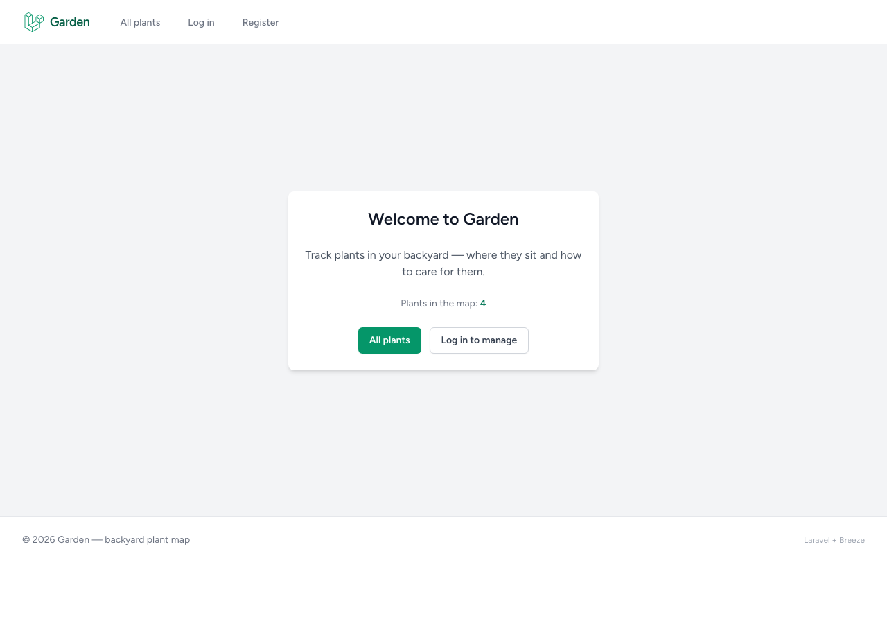
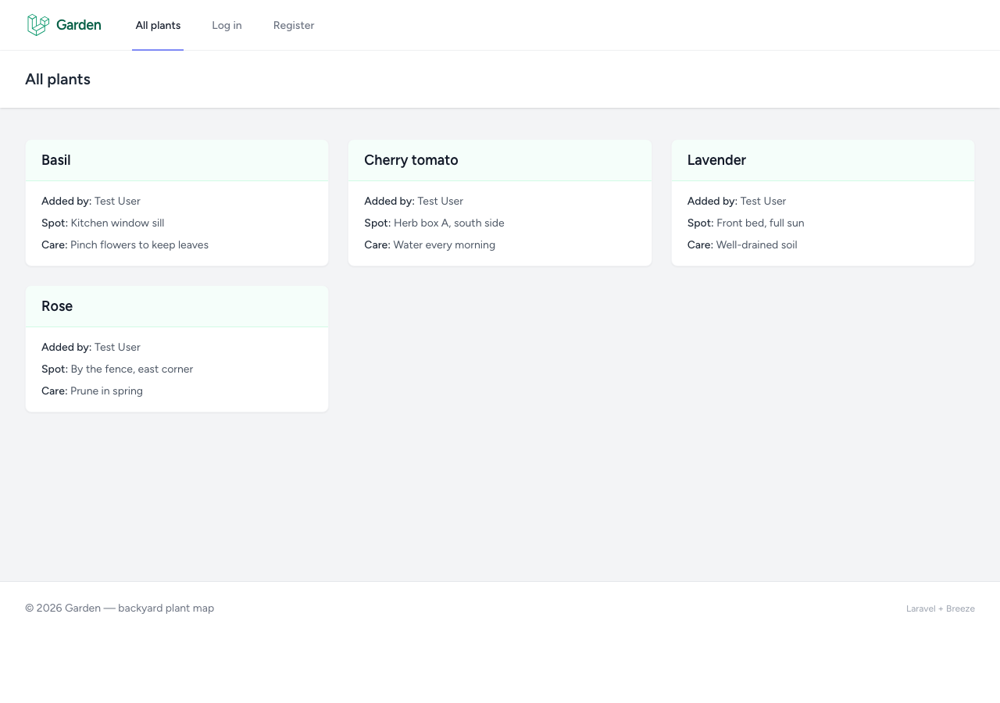
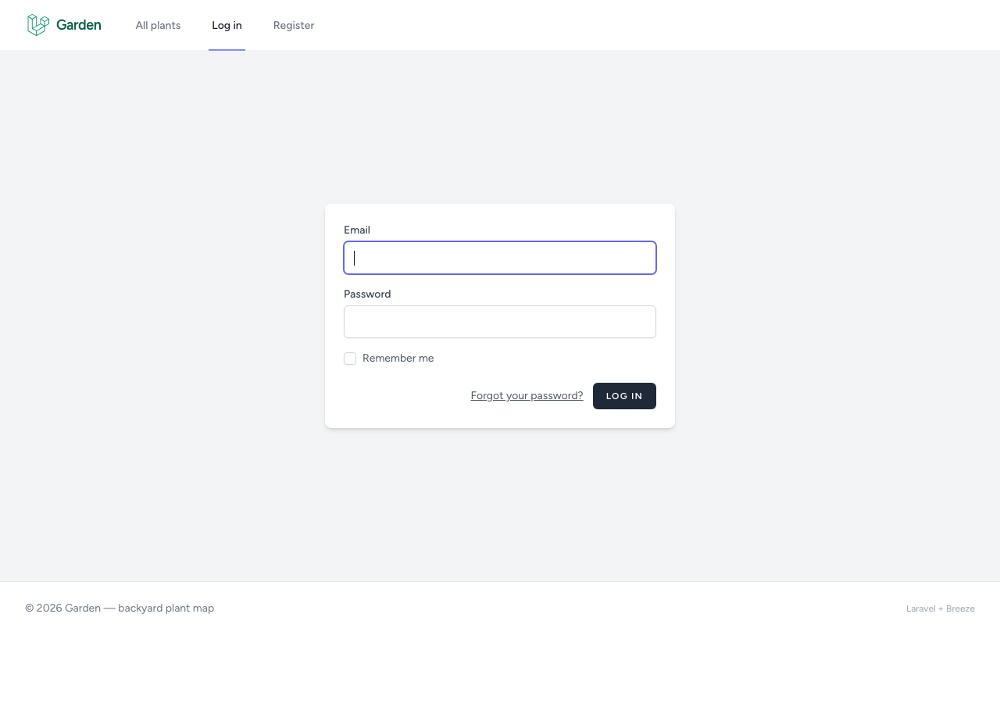
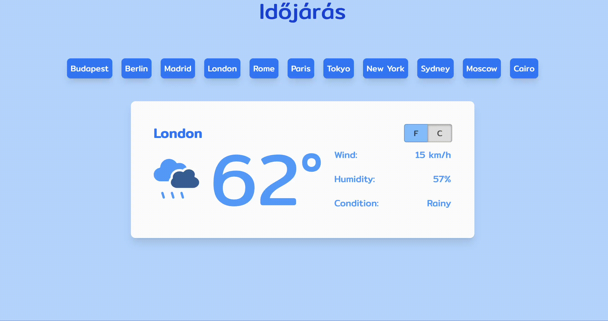
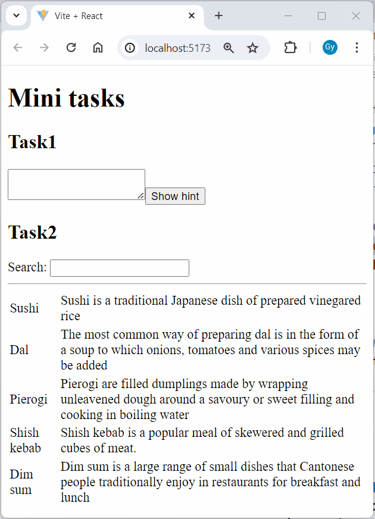
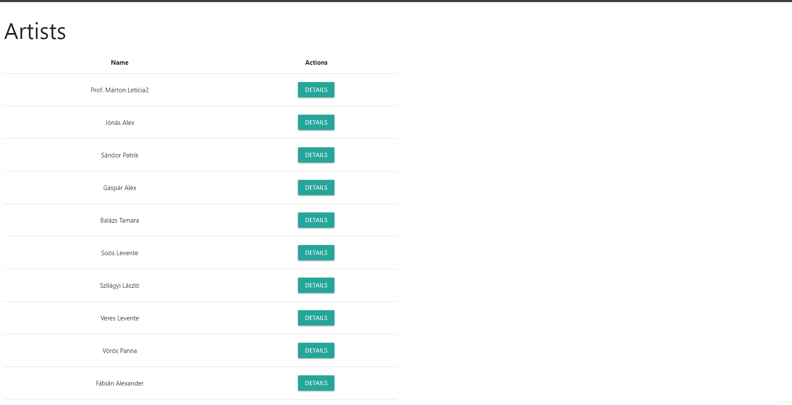

# AWP sample exam (40 + 40)

This repository contains an **exam** starter (`exam/`) and a **reference solution** (`solution/`). Part 1 is server-side (Laravel **Garden**). Part 2 is client-side (three small React + TypeScript apps).

| Area | Points | Pass threshold |
|------|--------|----------------|
| Part 1 — Laravel (`exam/tasks-laravel/Garden`) | 40 | ≥ 40% (16 pts) |
| Part 2 — React (`exam/tasks-react/*`) | 40 | ≥ 40% (16 pts) |

Overall exam rules (as communicated on the course): both parts must reach at least **40%**; the exam is in-person and supervised; you may bring prepared materials and **official language documentation** only; **no public internet** during the exam. The **`03-rest-holidays`** task uses a **local Fastify API** (fixtures on disk) — not third-party HTTP APIs.

---

## Repository layout

```text
exam/
  tasks-laravel/Garden/     # Laravel starter (intentional gaps)
  tasks-react/
    01-weather-component/
    02-find-the-problems/
    03-rest-holidays/       # client/ (Vite) + server/ (Fastify)
solution/
  tasks-laravel/Garden/     # Full Laravel reference
  tasks-react/              # Same three apps, completed
```

Task descriptions and scoring are in **this README**. **`03-rest-holidays`** also has a short **`README.md`** at that task root (`client/` + **`server/`** layout).

---

## Part 1 — Laravel: **Garden** (40 points)

**Story:** Track **plants** in a garden (`name`, `spot` in the yard, optional `care_note`). Each plant has optional **`user_id`** (who added it); the **reference solution** lists **all plants** vs **my plants** and shows the adder on cards. The UI uses **Laravel Breeze** defaults: Tailwind, **`layouts/app.blade.php`** (via `<x-app-layout>`), shared **`layouts/navigation.blade.php`**, **`layouts/guest.blade.php`** for auth screens, and a small **`layouts/footer.blade.php`**. After login, **`/dashboard`** is the main hub (overview + “plants you tend”). Set `APP_NAME=Garden` in `.env`.

### Reference screenshots (`solution/tasks-laravel/Garden`)

Example **Laravel** screenshots from the reference app (`php artisan migrate:fresh --seed`, `npm run build`, then `php artisan serve`, captured with headless Chrome). The six images below use repo-relative **``** paths: **`docs/images/laravel/*.png`** and **`docs/images/react/*.gif`**. To inline the three Laravel PNGs as base64 in this file (optional, for offline viewing), run **`node scripts/embed-readme-images.mjs`** from the repo root after updating those PNGs.







**Workload (40 points total):** **L1** 10 + **L2** 10 + **L3** 20. Implement the steps below; use the route names and middleware your examiner expects.

---

### L1 — Routes, controller, Blade + layout (10 points)

The starter already includes the **`plants`** table, **PlantSeeder**, and **`plants.user_id`** migration. Wire everything so the app actually lists plants.

**a.** Register **`GET /`** and name the route **`home`**.
**b.** If the visitor is **logged in**, **`/`** must **redirect** to **`dashboard`** (e.g. `route('dashboard')`).
**c.** If the visitor is a **guest**, show **`home`** and pass **`plantCount`** from **`Plant::count()`**.
**d.** Register **`GET /plants`** → **`PlantController@index`**, name **`plants.index`**.
**e.** In **`index()`**, load all plants from the database and **`return view('plants.index', compact('plants'))`** (no placeholder return).
**f.** Fix **`plants/index.blade.php`**: wrap the page in **`<x-app-layout>`** with a **header** slot.
**g.** Render **`$plants`** in a responsive Tailwind grid or cards; show **`name`**, **`spot`**, and **`care_note`** when it exists.
**h.** With **`migrate:fresh --seed`**, the plants page should render without throwing.

---

### L2 — Pivot migration & many-to-many (10 points)

You add the pivot; the exam archive does **not** ship that migration file.

**a.** Write a migration that creates **`plant_user`** (or a conventional equivalent) with **`user_id`** and **`plant_id`**.
**b.** Add **`timestamps()`** on the pivot and a **unique** constraint on **`(user_id, plant_id)`**.
**c.** Point both columns at **`users`** and **`plants`** with real **foreign keys**.
**d.** On **`User`**, add **`belongsToMany(Plant::class, …)`** (correct table / pivot keys if non-default).
**e.** On **`Plant`**, add the matching **`belongsToMany(User::class, …)`** inverse on the **same** pivot.

---

### L3 — Navigation, form, store, CSRF & auth (20 points)

Touch **`layouts/navigation.blade.php`**, the plant **create** Blade, **`PlantController@store`**, and **`routes/web.php`**.

**Navigation**

**a.** For **`@guest`**, show **plants** (browse), **log in**, and **register** (prefer **`route()`**).
**b.** For **`@auth`**, show **dashboard**, **plants**, **add plant**, and Breeze’s **profile / logout** affordances.
**c.** Guests must **not** see **dashboard** or **add plant** as normal nav items.

**Create form and `store`**

**a.** After validation, **save** the plant (e.g. **`Plant::create`**).
**b.** Fix the form so the input name is **`spot`**, not **`garden_spot`**.
**c.** On success, redirect or flash a message; a valid POST must not return **500**.

**CSRF and route protection**

**a.** Add **`@csrf`** to the plant form so you do not get **419** on POST.
**b.** Protect **`POST /plants`** with **`auth`**; guests get **redirect** or **403**.
**c.** Put **`GET /plants/create`** in the same **`auth`** (or verified) group as required.
**d.** A guest hitting **`GET /plants/create`** must **not** see the form.
**e.** As a logged-in user, complete **create → submit →** see the new plant in the DB or on the list.

---

### Reference (exam vs solution)

The **exam** starter matches the tasks above. The **solution** may add extra UX (**all vs my plants**, **added by** on cards); your course can ignore that for marking unless it says otherwise.

**Run (exam or solution):**

```bash
cd exam/tasks-laravel/Garden   # or solution/...
composer install
cp .env.example .env            # if needed
php artisan key:generate
php artisan migrate:fresh --seed
npm install && npm run build    # Breeze assets
php artisan serve
```

---

## Part 2 — React + TypeScript (40 points)

Use **Node 20+**. In each task folder: `npm install`, `npm run dev`, `npm run build`. For **`03-rest-holidays`**, use **`server/`** + **`client/`**: start the API first (`cd …/03-rest-holidays/server && npm install && npm run dev`), then the Vite app (`cd …/03-rest-holidays/client && npm install && npm run dev`). For **`npm run build`** / **`vite preview`**, set **`VITE_HOLIDAYS_API_URL`** — see **`client/.env.example`**.

**Workload (40 points):** **R1** 15 + **R2** 10 + **R3** 15 (`01-weather-component`, `02-find-the-problems`, `03-rest-holidays`). Follow the **`exam`** starters and align with the **`solution`**. Each task includes a reference **``** GIF (from the *Kliensoldali webprogramozás* **`zh`** archive — same idea, not a pixel-perfect spec).

---

### R1 — `01-weather-component` (15 points) — weather UI

**a.** Import **`weatherList`** (and **`WeatherCity`** if needed) from **`./data/weather`** and pass it to **`CitiesList`** so the city list shows and you can select a city.

**b.** Store the **selected city** in React **state**; when the list is not empty, **default** to the **first** city.

**c.** Wire **`handleCityChange(id)`** so it selects the city with that **`id`** (e.g. `weatherList.find(…)`).

**d.** Pass the selected city into **`Forecast`** and render **name**, **icon**, **temperature**, and the **wind**, **humidity**, and **condition** fields from **`details`**.

**e.** Keep the **°C / °F** switch inside **`Forecast`** as **local** `useState<'C' | 'F'>` and connect the radios to the bundled Celsius/Fahrenheit values.



---

### R2 — `02-find-the-problems` (10 points) — Task A + Task B

**Task A — `TaskA/TaskA.tsx`**

**a.** Make **“+5 minutes”** update the **modified** clock immediately (minutes and carry hours as needed), as shown by **`Time`**.

**b.** Make **“Toggle show seconds”** show or hide seconds on the **modified** clock **without** mutating the shared **`initialTime`** object used for **“Initial time”** (fix the shared-mutation / bad state update bug in the starter).

**Task B — `TaskB/Box.tsx`**

**c.** When the user changes the colour **`<select>`**, update the positioned **box** fill so it matches the chosen colour (fix how **`Box`** reads **`color`** from props).



---

### R3 — `03-rest-holidays` (15 points) — API + router

**a.** **`cd 03-rest-holidays/server`**, run **`npm install`** and **`npm run dev`** (default **`http://127.0.0.1:4010`**). Start the API **before** the Vite app in **`client/`**.

**b.** Load countries and holidays **only via HTTP** from your Fastify app (fixtures live in **`server/data/*.json`**). Do **not** call **`date.nager.at`** and do **not** **`import`** those JSON files in the client as the main data source.

**API (reference)**

| Method | Path | Response |
|--------|------|------------|
| `GET` | `/api/health` | `{ "ok": true }` |
| `GET` | `/api/countries` | Full `countries.json` array |
| `GET` | `/api/countries/:countryCode/holidays?year=YYYY` | Holidays filtered by `countryCode` and year prefix |

**c.** Use **`client/src/holidaysApi.ts`** (`countriesEndpoint`, **`holidaysEndpoint`**). In dev, **`client/vite.config.ts`** proxies **`/api`** to the server so **`fetch('/api/...')`** works; for **`npm run build`** / **`vite preview`**, set **`VITE_HOLIDAYS_API_URL`** as in **`client/.env.example`**. More detail: **`server/README.md`**.

**d.** **`fetch`** the country list from **`GET /api/countries`** (or the proxied **`/api/countries`** path) and render a table of **`Link`**s to **`/{countryCode}`**.

**e.** Set up **`main.tsx`** / **`react-router-dom`** with a **nested** route: parent layout shows the country table, child route **`:countryCode`** shows holidays with an **`Outlet`**.

**f.** On the holidays screen, **`fetch`** **`GET /api/countries/:countryCode/holidays?year=…`** whenever **country** or **year** changes; add a working **year** input (`type="number"` or equivalent).

**g.** Show each holiday’s **date** and **name** in a table and add a **“Back”** **`Link`** to **`/`**.




---


